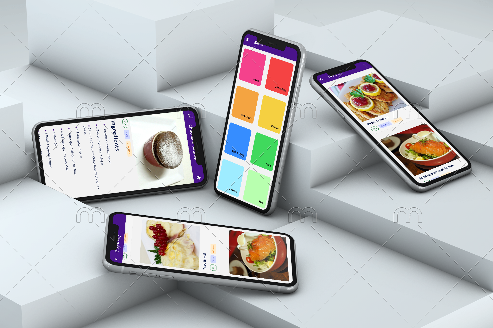
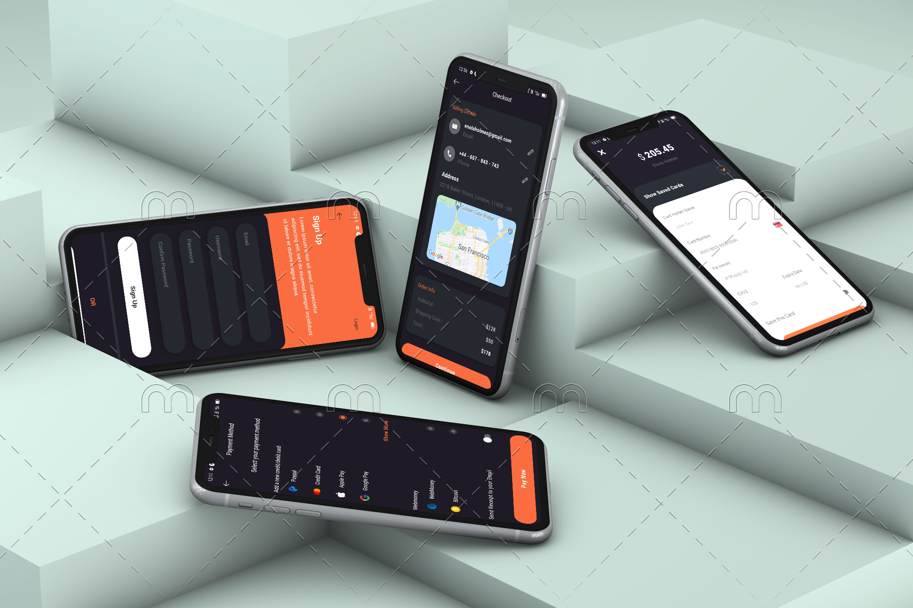

# React Native

A repository for tracking React Native learning with Expo.

#

### Meals App

An app to show meals categories and information.

Points:

- Tab Navigation.
- Stack Navigation.
- Drawer Navigation.
- Styles.
- Expo Icons and Fonts.
- Navigation Props and Params.

#

### Plants App

An app to show plants categories and information.

Points:

- Tab Navigation.
- Stack Navigation.
- Elegant UI.
- StatusBar Config.
- Eleven Screens
  - Home
  - Explore
  - Cart
  - Profile
  - Notifications
  - Transactions
  - Payment Method
  - Payment Status
  - Login
  - Signup
  - Plant Detail
- Navigation Props and Params.
- Lottie Files
- Native SVG

#

### Budget App

An app to show living expenses.

Points:

- Tab Navigation.
- Stack Navigation.
- Styles.
- Victory Native Charts.
- SVG.

#

### Food App

An app to order & track food from the restaurants.

Points:

- Tab Navigation
- Stack Navigation
- Status bar & Styles
- Google maps
- Animations
- Three Screens
  - Restaurant list
  - Restaurant Details
  - Order Map

#

### Book App

An app to buy & explore books online. To watch it on your device, download the expo app from Google Play Store & open the following link

> Link of Kitap App [Open in Expo](https://expo.dev/@tidbit/books)

Points:

- Tab Navigation
- Stack Navigation
- Status bar & styles
- Google maps
- Masked Inputs
- Animations
- Lottie Files
- Twelve Screens
  - Welcome
  - Sign In
  - Sign Up
  - Home
  - Discover
  - Cart
  - Profile
  - Checkout
  - Payment Method
  - Payment Info
  - Payment Success
  - Book Details

