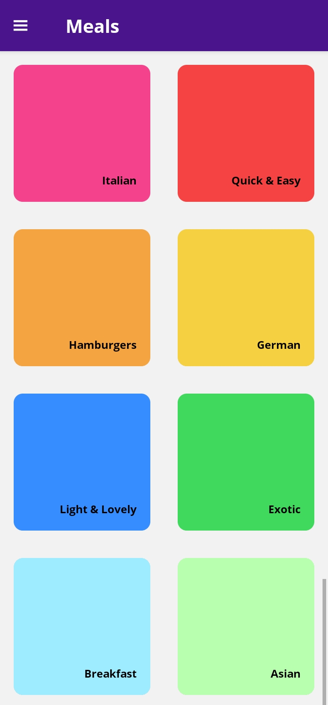
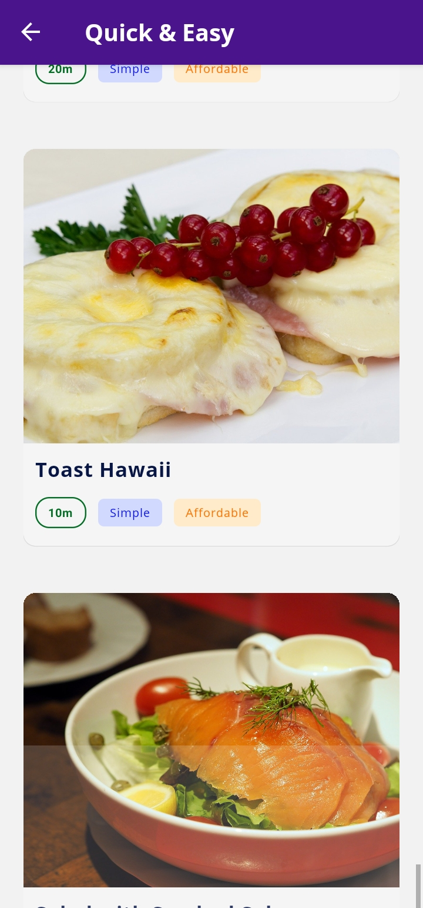
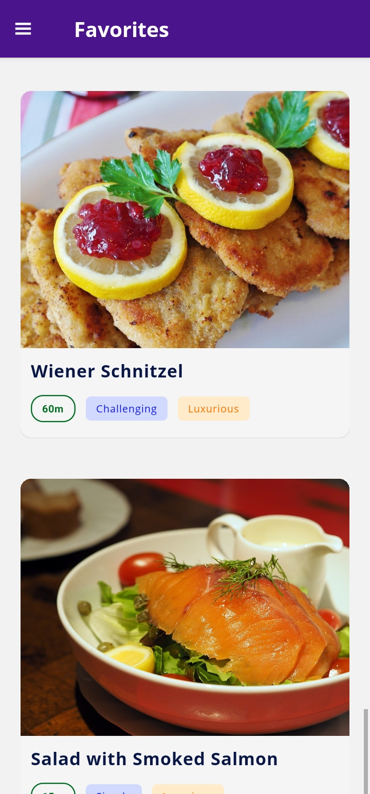
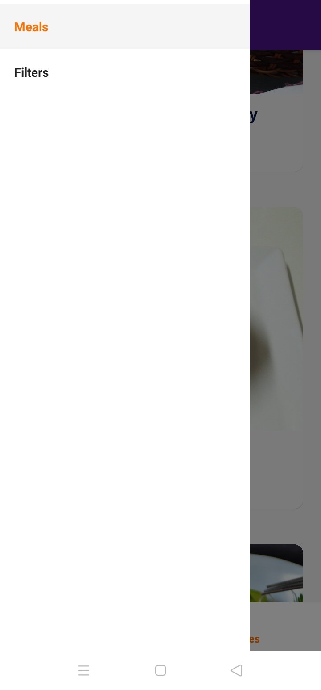
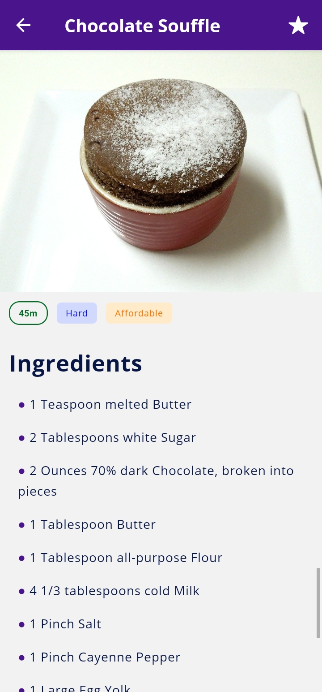

# React Native

A repository for tracking React Native learning with Expo.

#

### Meals App

An app to show meals categories and information.

Points:

 - Tab Navigation.
 - Stack Navigation.
 - Drawer Navigation.
 - Styles.
 - Expo Icons and Fonts.
 - Navigation Props and Params.

1. Home Screen

2. Meals Category Screen

3. Favorites Screen

4. Drawer

5. Meal Details Screen

#